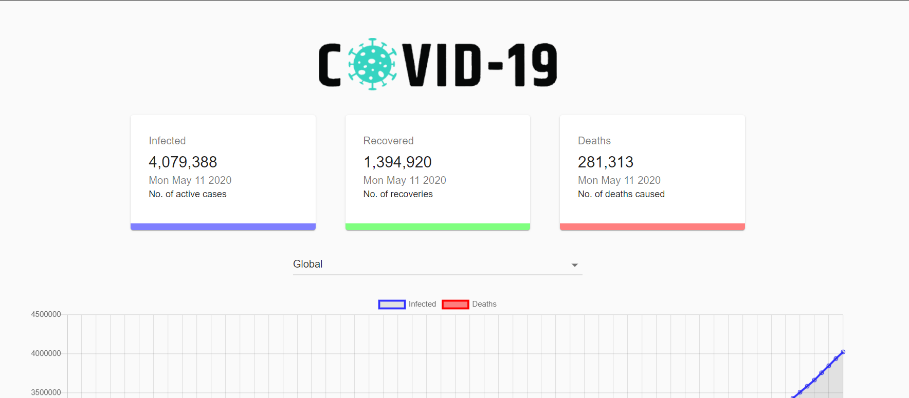

# coronaTracker
<br>
<p align="center">A full COVID-19 Tracker using React, Charts.JS and Material UI.</p>
<br>

<br><br>


API used: https://covid19.mathdro.id/api

Setup:
- run ```npm i && npm start```